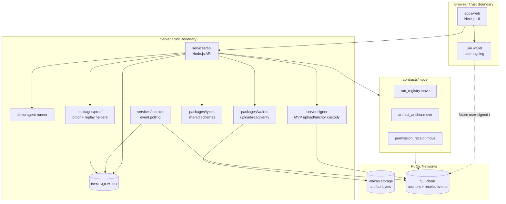
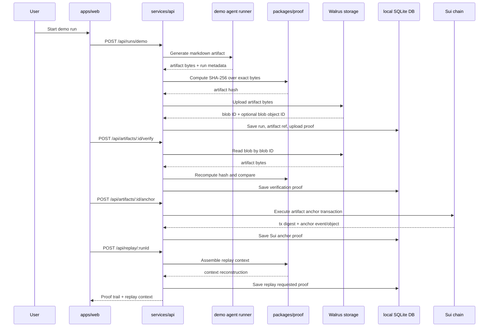
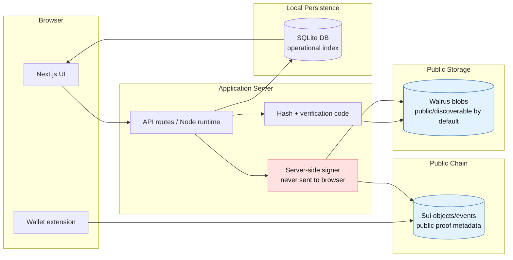

# System Architecture

## Overview

TraceLayer is split into a small web app, Node API, local database, shared packages, lightweight Move contracts, Walrus storage, and Sui proof anchoring. The MVP keeps all operational query state in the local database and uses Walrus/Sui for durable artifact availability and compact proof claims.

## Required Components

| Component | Responsibility | MVP Status |
| --- | --- | --- |
| `apps/web` | Next.js UI for runs, artifacts, proofs, replay, delegates | MVP |
| `services/api` | Node API for demo runs, Walrus upload/read/verify, Sui anchor calls | MVP |
| `services/indexer` | Polls Sui events and syncs proof receipts to local DB | Lightweight MVP / can run inside API initially |
| `packages/walrus` | Walrus client setup, upload, readback, verification helpers | MVP |
| `packages/proof` | Proof event creation, replay context assembly, hash utilities | MVP |
| `packages/types` | Shared TypeScript entity and API types | MVP |
| `contracts/move` | Lightweight Move modules for run, artifact, permission receipts | MVP |
| Local DB | SQLite operational index for runs, artifacts, proofs, delegates | MVP |
| Walrus storage | Durable artifact bytes and optional manifests | MVP |
| Sui chain | Compact anchors, receipt objects/events, transaction digests | MVP |
| Demo agent runner | Produces one markdown artifact and structured run metadata | MVP |

## Component Diagram

## MVP Data Flow

## Trust Boundary Diagram

## MVP Architecture

The MVP uses server-side custody for Walrus writes and Sui anchor transactions. This minimizes browser complexity and makes the demo reliable. The local database is the operational source of truth for run pages and proof timelines. Walrus is the artifact availability layer. Sui is the compact proof and receipt layer.

MVP services can be deployed as a single Next.js app with API routes or as a separate Node API if time permits. The architecture keeps `services/api` separate in the docs so it can grow without changing conceptual boundaries.

## Future Architecture

| Area | MVP | Future |
| --- | --- | --- |
| Upload | Server-side `writeBlob` | Browser wallet flow using `writeBlobFlow` / `writeFilesFlow` |
| Storage layout | One markdown artifact per run | Multi-artifact manifests and Walrus quilts |
| Indexing | API-triggered writes plus simple event polling | Dedicated checkpoint/event indexer |
| Access control | Local records plus receipt events | Seal-encrypted artifacts and policy-bound access |
| Memory refs | References only, no plaintext private memory | MemWal integration for encrypted memory pointers |
| Identity | Local owner address + normal wallet | zkLogin, organizations, team delegates |
| Replay | Context reconstruction | Replay graphs, evaluator outputs, imported traces |
| Contracts | Lightweight anchor and receipt modules | Upgrade policy, richer package, optional shared registry |

## Component Boundaries

### `apps/web`

Reads API responses and renders proof-focused flows. It does not hold private keys or upload secrets. Wallet connection is only for user-visible ownership/signing flows.

### `services/api`

Coordinates demo runs, Walrus uploads, readback verification, local DB writes, Sui anchors, and replay assembly. It is the only MVP component allowed to load server signer material.

### `services/indexer`

Polls Sui events and reconciles local proof records. For MVP it may run as a scheduled API task, but it remains a named component to keep the production path clear.

### `packages/walrus`

Owns Walrus client initialization, upload, readback, and hash verification wrappers. It must preserve the distinction between Walrus `blobId` and Sui blob object ID.

### `packages/proof`

Owns proof event construction, replay context assembly, deterministic serialization assumptions, and proof root calculation.

### `packages/types`

Owns shared entity and API types so UI, API, proof helpers, and DB schema use consistent names.

### `contracts/move`

Owns Move modules for compact on-chain receipts. Contracts store identifiers and hashes, not artifact bytes or private context.
